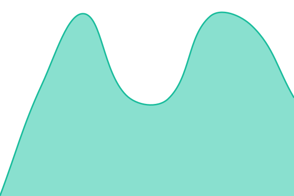
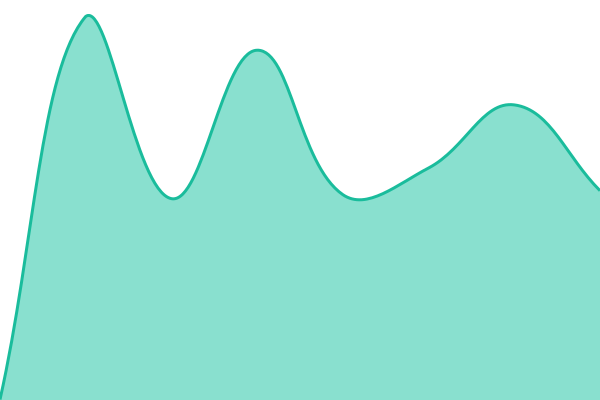

# [📈 Live Status](https://landra-sistemas.github.io/upptime): <!--live status--> **🟧 Partial outage**

This repository contains the open-source uptime monitor and status page for [landra-sistemas](http://landrasistemas.es/), powered by [Upptime](https://github.com/upptime/upptime).

With [Upptime](https://upptime.js.org), you can get your own unlimited and free uptime monitor and status page, powered entirely by a GitHub repository. We use [Issues](https://github.com/landra-sistemas/upptime/issues) as incident reports, [Actions](https://github.com/landra-sistemas/upptime/actions) as uptime monitors, and [Pages](https://landra-sistemas.github.io/upptime) for the status page.

<!--start: status pages-->
<!-- This summary is generated by Upptime (https://github.com/upptime/upptime) -->
<!-- Do not edit this manually, your changes will be overwritten -->
<!-- prettier-ignore -->
| URL | Status | History | Response Time | Uptime |
| --- | ------ | ------- | ------------- | ------ |
|  [Landra Website](https://www.landrasistemas.es) | 🟩 Up | [landra-website.yml](https://github.com/landra-sistemas/upptime/commits/HEAD/history/landra-website.yml) | 

 5106ms
     
 | 

<a href="https://landra-sistemas.github.io/upptime/history/landra-website">100.00%</a>
    

|  [Dashboard](https://dash.landrasoftware.com) | 🟩 Up | [dashboard.yml](https://github.com/landra-sistemas/upptime/commits/HEAD/history/dashboard.yml) | 

 806ms
     
 | 

<a href="https://landra-sistemas.github.io/upptime/history/dashboard">97.10%</a>
    

|  [Telf. Guardia Landra](https://integration.landrasoftware.com/GuardiaLandra) | 🟩 Up | [telf-guardia-landra.yml](https://github.com/landra-sistemas/upptime/commits/HEAD/history/telf-guardia-landra.yml) | 

 548ms
     
 | 

<a href="https://landra-sistemas.github.io/upptime/history/telf-guardia-landra">100.00%</a>
    

|  [Telf. Guardia Abbot](https://integration.landrasoftware.com/GuardiaAbbott) | 🟩 Up | [telf-guardia-abbot.yml](https://github.com/landra-sistemas/upptime/commits/HEAD/history/telf-guardia-abbot.yml) | 

 484ms
     
 | 

<a href="https://landra-sistemas.github.io/upptime/history/telf-guardia-abbot">100.00%</a>
    

|  [Sonarqube (DEV)](https://sonar.landrasoftware.com) | 🟩 Up | [sonarqube-dev.yml](https://github.com/landra-sistemas/upptime/commits/HEAD/history/sonarqube-dev.yml) | 

 657ms
     
 | 

<a href="https://landra-sistemas.github.io/upptime/history/sonarqube-dev">97.10%</a>
    

|  [GasNatural (Clientes)](https://www.portaleolico.com) | 🟩 Up | [gas-natural-clientes.yml](https://github.com/landra-sistemas/upptime/commits/HEAD/history/gas-natural-clientes.yml) | 

 1662ms
     
 | 

<a href="https://landra-sistemas.github.io/upptime/history/gas-natural-clientes">100.00%</a>
    

|  [Ypsofact (Clientes)](https://ypsofact.landrasoftware.com/) | 🟩 Up | [ypsofact-clientes.yml](https://github.com/landra-sistemas/upptime/commits/HEAD/history/ypsofact-clientes.yml) | 

 524ms
     
 | 

<a href="https://landra-sistemas.github.io/upptime/history/ypsofact-clientes">100.00%</a>
    

|  [Microviable (Clientes)](https://microbiota.microviable.com/) | 🟩 Up | [microviable-clientes.yml](https://github.com/landra-sistemas/upptime/commits/HEAD/history/microviable-clientes.yml) | 

 549ms
     
 | 

<a href="https://landra-sistemas.github.io/upptime/history/microviable-clientes">100.00%</a>
    

|  [Uriach (Clientes)](https://uriach.landrasoftware.com/) | 🟩 Up | [uriach-clientes.yml](https://github.com/landra-sistemas/upptime/commits/HEAD/history/uriach-clientes.yml) | 

 609ms
     
 | 

<a href="https://landra-sistemas.github.io/upptime/history/uriach-clientes">100.00%</a>
    

|  [Oficina (WAN)](https://oficina.landrasistemas.net/) | 🟩 Up | [oficina-wan.yml](https://github.com/landra-sistemas/upptime/commits/HEAD/history/oficina-wan.yml) | 

 820ms
     
 | 

<a href="https://landra-sistemas.github.io/upptime/history/oficina-wan">100.00%</a>
    

|  [Synology C2 Identity](https://integration.landrasoftware.com/synology_check?filter=Identity) | 🟩 Up | [synology-c2-identity.yml](https://github.com/landra-sistemas/upptime/commits/HEAD/history/synology-c2-identity.yml) | 

 988ms
     
 | 

<a href="https://landra-sistemas.github.io/upptime/history/synology-c2-identity">100.00%</a>
    

|  [Synology C2 Password](https://integration.landrasoftware.com/synology_check?filter=Password) | 🟩 Up | [synology-c2-password.yml](https://github.com/landra-sistemas/upptime/commits/HEAD/history/synology-c2-password.yml) | 

 624ms
     
 | 

<a href="https://landra-sistemas.github.io/upptime/history/synology-c2-password">100.00%</a>
    

|  [ESET Protect Cloud](https://integration.landrasoftware.com/eset_check) | 🟥 Down | [eset-protect-cloud.yml](https://github.com/landra-sistemas/upptime/commits/HEAD/history/eset-protect-cloud.yml) | 

 787ms
     
 | 

<a href="https://landra-sistemas.github.io/upptime/history/eset-protect-cloud">47.27%</a>
    

|  [Gaia HD](https://gaia-hd.landrasoftware.com) | 🟩 Up | [gaia-hd.yml](https://github.com/landra-sistemas/upptime/commits/HEAD/history/gaia-hd.yml) | 

 1056ms
     
 | 

<a href="https://landra-sistemas.github.io/upptime/history/gaia-hd">100.00%</a>
    

|  [IAM](https://iam.landrasoftware.com) | 🟩 Up | [iam.yml](https://github.com/landra-sistemas/upptime/commits/HEAD/history/iam.yml) | 

 1443ms
     
 | 

<a href="https://landra-sistemas.github.io/upptime/history/iam">100.00%</a>
    

<!--end: status pages-->

[**Visit our status website →**](https://landra-sistemas.github.io/upptime)

## 📄 License

- Powered by: [Upptime](https://github.com/upptime/upptime)
- Code: [MIT](./LICENSE) © [Anand Chowdhary](https://anandchowdhary.com), supported by [Pabio](https://pabio.com)
- Data in the `./history` directory: [Open Database License](https://opendatacommons.org/licenses/odbl/1-0/)
